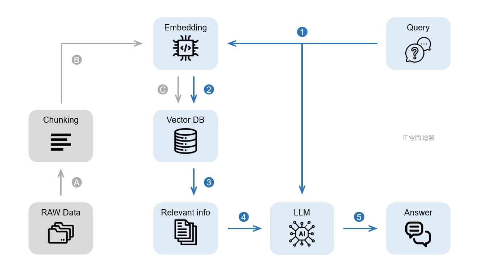

# rag implementation
最小rag框架的从零到1实现（minimal rag implementation）  

## 1.Description
框架结构包含query -> embedding -> reranker -> LLM -> out  

## 2.QuickStart
项目中包含两个实现方式
1. 基于langchain框架实现的rag系统
>  python langchain_rag.py
2. 不采用框架0-1实现的rag系统
> test_rag.ipynb

### To Update
1. data chunk方式
2. Rerank